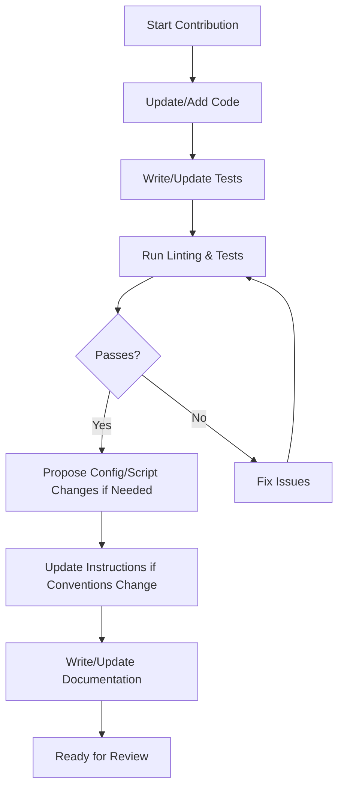

# Copilot Instructions for Agent Contributions

This guide enables robust, maintainable, and extensible agent (and human) development in this repository.  
All contributions must follow these instructions to ensure code quality, discoverability, and developer experience.

---

## Contribution Workflow

---

## Contribution Checklist

- [ ] Update or add code following best practices:
    - Modularization
    - Decoupling
    - Discoverability
    - Extensibility
    - Cohesiveness
- [ ] Write or update tests to cover new/changed code.
- [ ] Run linting and all tests locally.
- [ ] Propose configuration/script changes only if they do **not** sacrifice maintainability or developer experience.
- [ ] Document all configuration/script changes and rationale.
- [ ] Update these instructions if conventions or patterns change.
- [ ] Ensure CI/CD pipelines are updated as needed.
- [ ] Write or update documentation for all changes.

---

## Source Code Layout

The repository is organized as follows (update this section if you change the layout):

- `src/` — Core source code for the Discord bot, including API handlers, command definitions, and integrations.
  - `src/commands/` — Each command handler in its own file. All commands registered in `src/commands/registry.ts`.
  - `src/services/` — Service modules for integrations (e.g., Discord, Reddit).
- `test/` — Unit and integration tests for commands, services, and main bot logic.
  - `test/commands/` — Tests for each command.
  - `test/services/` — Tests for each service.
  - `test/e2e/` — End-to-end tests.
- `scripts/` — Deployment and utility scripts.
- `docs/` — Documentation (to be deprecated as instructions are migrated).
- `wrangler.toml` — Cloudflare Worker deployment configuration.
- `package.json` — Project dependencies and scripts.

**Directive:**  
If your contribution changes the source code layout (adds, removes, or reorganizes files/directories), update this section to reflect the new structure.

---

## Coding Standards & Architectural Principles

- Follow language and tool best practices.
- Prioritize maintainable, readable, and well-documented code.
- Design for modularity and extensibility.
- Decouple components where possible.
- Ensure code is discoverable and cohesive.

---

## Documentation & Testing

- Every contribution must include relevant documentation updates.
- All new or changed code must be covered by tests.
- Documentation should be clear, concise, and easy to find.

---

## Configuration & Script Changes

- Suggest changes only if they do **not** sacrifice maintainability or developer experience.
- Document all changes and their rationale.

---

## Maintaining Instructions

- Propose updates to these instructions as conventions evolve.
- Keep instructions self-contained and up-to-date.

---

## Tech Stack & Tools

This repository uses the following technologies and tools:

- **TypeScript** — Main programming language for source code and tests.
- **Node.js** — Runtime environment for development and testing.
- **Cloudflare Workers** — Serverless platform for deploying the Discord bot.
- **Wrangler** — CLI tool for building and deploying Cloudflare Workers (`wrangler.toml` for config).
- **Discord API** — For bot interactions and commands.
- **Vitest** — Testing framework for unit, integration, and e2e tests.
- **GitHub Actions** (recommended) — For CI/CD automation.

Other tools and dependencies may be added as the project evolves. Update this section if you introduce or remove major technologies or tools.
