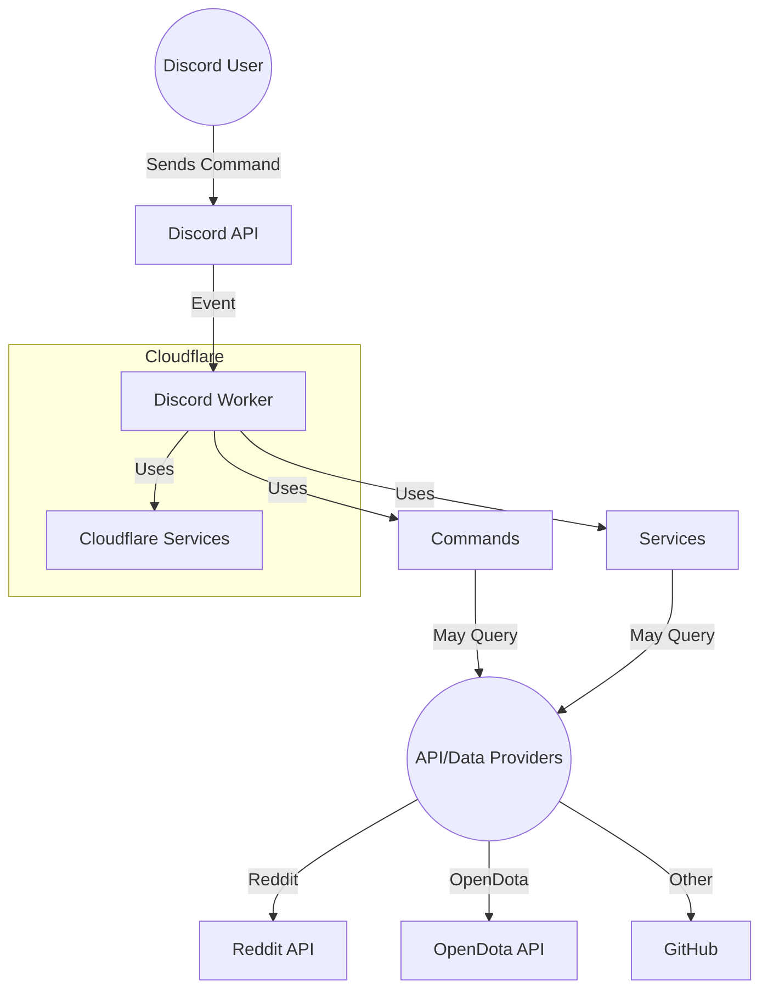

# High-Level System Architecture

This diagram shows the Discord Worker bot hosted on Cloudflare, interacting with Discord users via the Discord API, and using various API/data providers for command functionality. Cloudflare Services (such as KV and Durable Objects) are used by the bot's commands for state and data management.
