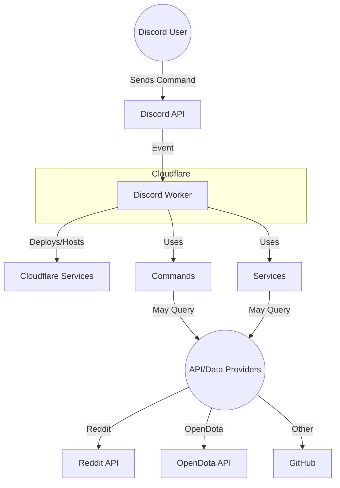

# High-Level System Architecture

This diagram shows the Discord Worker bot hosted on Cloudflare, interacting with Discord users via the Discord API, and using various API/data providers for command functionality. Deployment and hosting are managed by Cloudflare services.
