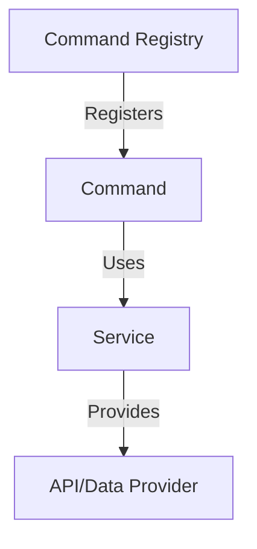

# Command Registration & Service Reference

This generalized diagram shows how commands are registered in the registry and reference services, which in turn may interact with external API/data providers. This supports modularity and extensibility without coupling documentation to specific implementations.
