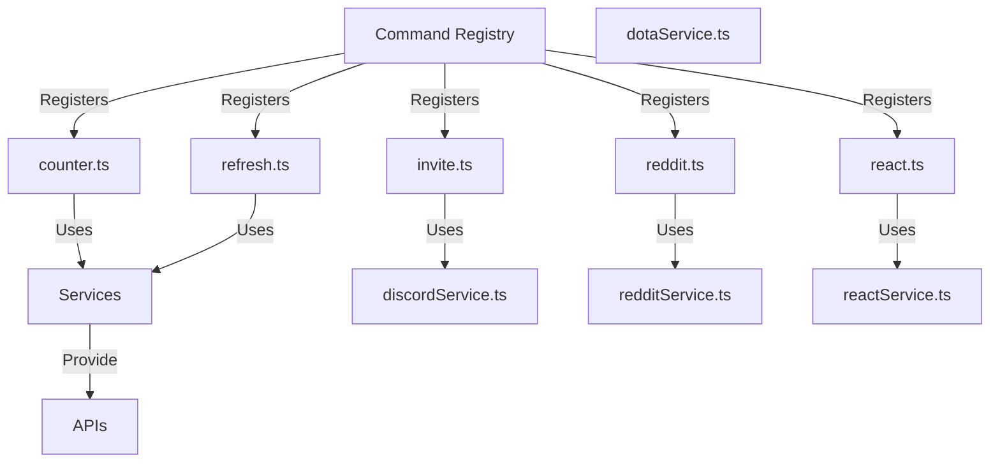

# Command Registration & Service Reference

```mermaid
graph TD
    Registry[Command Registry]
    Counter[counter.ts]
    Invite[invite.ts]
    React[react.ts]
    Reddit[reddit.ts]
    Refresh[refresh.ts]
    Services[Services]
    DiscordService[discordService.ts]
    RedditService[redditService.ts]
    DotaService[dotaService.ts]
    ReactService[reactService.ts]

    Registry-->|Registers|Counter
    Registry-->|Registers|Invite
    Registry-->|Registers|React
    Registry-->|Registers|Reddit
    Registry-->|Registers|Refresh
    Counter-->|Uses|Services
    Invite-->|Uses|DiscordService
    React-->|Uses|ReactService
    Reddit-->|Uses|RedditService
    Refresh-->|Uses|Services
    Services-->|Provide|APIs
```

This diagram shows how commands are registered and reference services, supporting modularity and extensibility.
