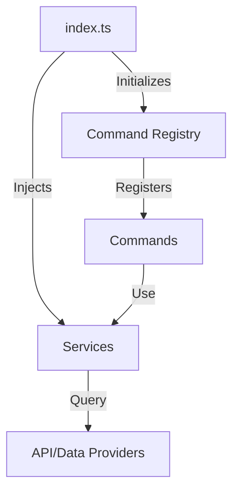

# Component Overview & Dependency Injection

This diagram highlights how the main entry point initializes the command registry and injects services, enabling modularity and extensibility through dependency injection.
