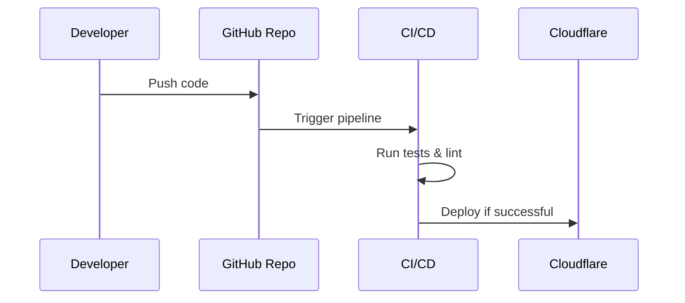
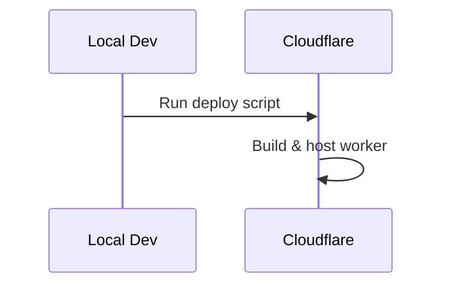
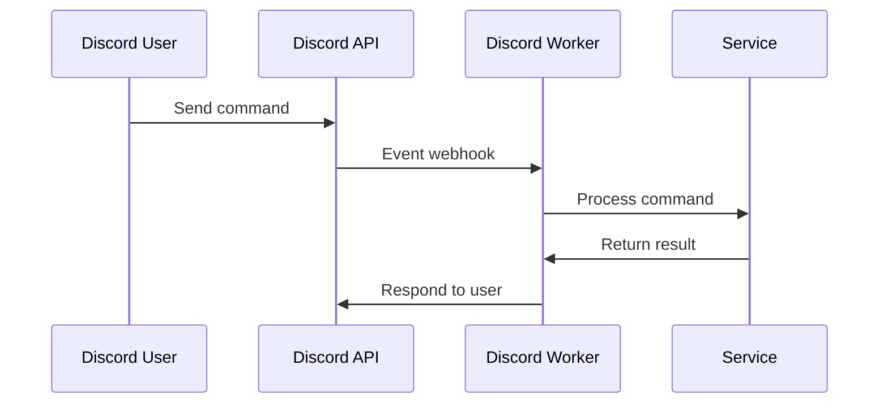

# Workflow Sequence Diagrams

## Contributing to the App

```mermaid
sequenceDiagram
    participant Dev as Developer
    participant Repo as GitHub Repo
    participant CI as CI/CD
    participant Cloudflare as Cloudflare
    Dev->>Repo: Push code
    Repo->>CI: Trigger pipeline
    CI->>CI: Run tests & lint
    CI->>Cloudflare: Deploy if successful
```

## Deploying the App

```mermaid
sequenceDiagram
    participant Local as Local Dev
    participant Cloudflare as Cloudflare
    Local->>Cloudflare: Run deploy script
    Cloudflare->>Cloudflare: Build & host worker
```

## Bot Command Lifecycle

```mermaid
sequenceDiagram
    participant User as Discord User
    participant Discord as Discord API
    participant Worker as Discord Worker
    participant Service as Service
    User->>Discord: Send command
    Discord->>Worker: Event webhook
    Worker->>Service: Process command
    Service->>Worker: Return result
    Worker->>Discord: Respond to user
```
