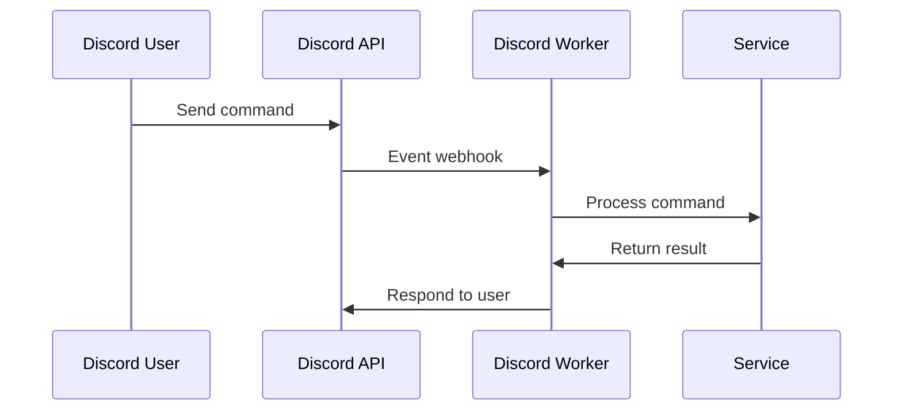

# Workflow Sequence Diagrams

## Bot Command Lifecycle

```mermaid
sequenceDiagram
    participant User as Discord User
    participant Discord as Discord API
    participant Worker as Discord Worker
    participant Service as Service
    User->>Discord: Send command
    Discord->>Worker: Event webhook
    Worker->>Service: Process command
    Service->>Worker: Return result
    Worker->>Discord: Respond to user
```
